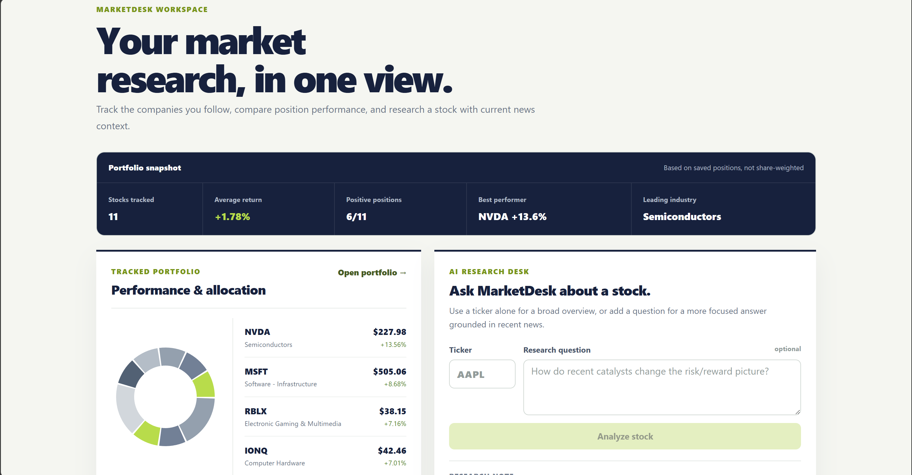
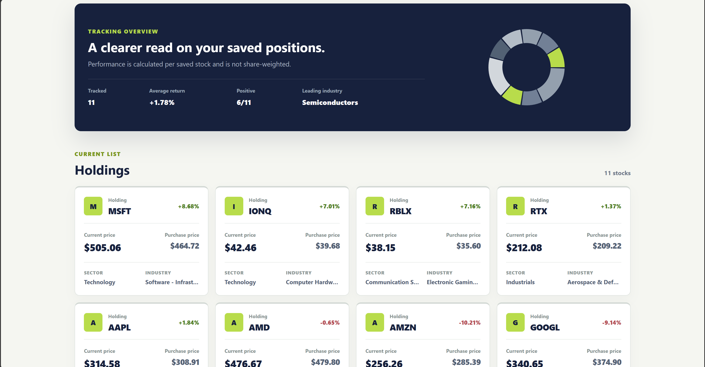

# AI Stock Research Site
A full-stack stock research and portfolio holdings application that combines market data, saved portfolio information, and AI-generated stock summaries.

> **Source Availability:** The full implementation is maintained in a private repository. This public demo repository contains project documentation, architecture, and a view of the codebase structure without publishing source code.

## Demo

### Dashboard



### Portfolio



## What It Does

This site is designed as a single workspace for researching and tracking stocks. Users can create an account, request a single stock analysis, add companies to a portfolio, and return to those companies later on.

The analysis workflow runs asynchronously so the frontend can submit a stock request, poll for the completed job, and display the result when processing finishes.

## Key Features

- User registration and login with hashed-password storage
- Stock lookup and LLM generated company summaries
- Background generation jobs with status polling
- Portfolio statistics and information saved to a user account
- PostgreSQL-backed data storage
- Local Hugging Face LLM-based analysis workflow
- Retrieval-augmented generation using semantic search with ChromaDB
- News/data collection used by the analysis pipeline
- React interface built with Bootstrap

## My Stack

### Frontend

- React
- Vite
- React Router
- Bootstrap

### Backend

- Python
- FastAPI
- SQLAlchemy
- PostgreSQL
- Pydantic

### AI / Data Pipeline

- Hugging Face Transformers
- Sentence Transformers
- Chroma vector database
- LangChain integrations

### Infrastructure

- Redis caching — caches frequently requested stock generations to reduce repeated generation work.
- Docker — containerizes the application and simplifies local setup and service orchestration.

## Project Structure

```text
project/
├── frontend/
│   ├── public/
│   └── src/
│       ├── assets/
│       ├── components/
│       │   ├── analysis interface
│       │   ├── navigation
│       │   ├── stock cards
│       │   └── shared UI
│       ├── pages/
│       │   ├── home
│       │   ├── dashboard
│       │   ├── portfolio
│       │   └── authentication
│       └── styles/
│
├── backend/
│   ├── database/
│   │   ├── connection / session management
│   │   ├── models
│   │   └── data-access helpers
│   ├── processes/
│   │   ├── LLM analysis
│   │   ├── retrieval pipeline
│   │   ├── news collection
│   │   └── utilities
│   └── API application
│
├── vector-store/
└── configuration/
```

## How the Analysis Flow Works

1. The user enters a ticker and question in the React frontend.
2. The frontend submits the request to FastAPI.
3. The backend creates a background job and returns a job ID.
4. The frontend polls the job endpoint until completion/failure.
5. The agent retrieves related news from external sources along with information and analytics from the vector store.
6. The local LLM pipeline produces a specific stock summary.
7. The completed result is returned to the frontend.
8. The user can save the stock to their portfolio for later review.

## Engineering Decisions

### Asynchronous analysis requests

AI stock research can take longer than a normal API request, even more so on a local gpu. The application separates job submission from result retrieval so the remaining features remain usable during generation.

### Separate relational and vector databases

PostgreSQL is used to store structured application data such as users, portfolio relationships, and stock records. 

Chroma is used separately for similarity-based retrieval in the analysis pipeline.

## Roadmap

- [ ] Expand automated backend and frontend testing
- [ ] Add deployment and production configuration


## Repo Note

This repository is a portfolio showcase and intentionally does not include source code, .env files, database contents, models, browser profiles, or private configuration.
